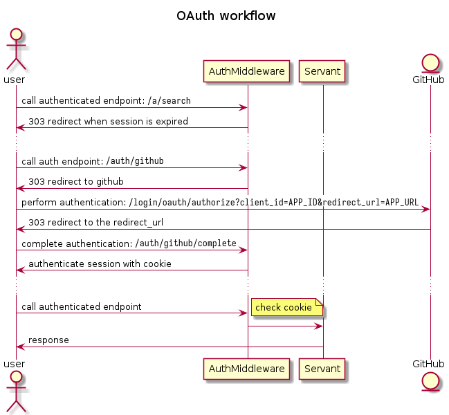

With [monocle#412](https://github.com/change-metrics/monocle/pull/412) we are
adding OAuth support to our new servant application.
The goal is to enable user authentication so that the interface can be
personalized, for example by adding support for the `self` value in search queries.

The challenge is to perform the OAuth handshake to resolve the user identity.

# Workflow

Here is the sequence diagram:

<center></center>

# OAuth configuration

Currently there is no native solution for OAuth in servant, so we are going to
use the `wai-middleware-auth`. Its configuration looks like this:

```haskell
-- | 'authSettings' returns the @wai-middleware-auth@ configuration
authSettings :: Text -> Text -> Text -> Text -> Auth.AuthSettings
authSettings publicUrl oauthName oauthId oauthSecret =
  Auth.setAuthAppRootStatic publicUrl
    . Auth.setAuthPrefix "auth"
    . Auth.setAuthProviders providers
    . Auth.setAuthSessionAge (3600 * 24 * 7)
    $ Auth.defaultAuthSettings
  where
    emailAllowList = [".*"]
    ghProvider =
      Auth.Provider $
        Auth.mkGithubProvider oauthName oauthId oauthSecret emailAllowList Nothing
    providers = HM.fromList [("github", ghProvider)]
```


# Dispatching the requests

In monocle, we want to support both annonymous and authenticated users, and the
`wai-middleware-auth` enforces authentication for every request. So we create an
extra middleware to dispatch the authentication only when necessary:

```haskell
-- | Apply the @wai-middleware-auth@ only on the paths starting with a /a/
--
-- >>> type Application = Request -> (Response -> IO ResponseReceived) -> IO ResponseReceived
-- >>> type Middleware = Application -> Application
enforceLoginPath :: Wai.Middleware -> Wai.Middleware
enforceLoginPath authMiddleware monocleApp = app'
  where
    app' request
      | matchAuth (Wai.rawPathInfo request) = (authMiddleware monocleApp) request
      | otherwise = monocleApp request
    matchAuth path
      | "/a/" `BS.isPrefixOf` path || "/auth" `BS.isPrefixOf` path = True
      | otherwise = False
```

# Creating the middleware

We only enable the middleware when there is an OAuth application environment:

```haskell
-- | Create the middleware with the custom login path dispatch
createAuthMiddleware :: IO Wai.Middleware
createAuthMiddleware = do
  envs <- traverse lookupEnv ["PUBLIC_URL", "OAUTH_NAME", "OAUTH_ID", "OAUTH_SECRET"]
  case toText <$> catMaybes envs of
    [publicUrl, oauthName, oauthId, oauthSecret] ->
      enforceLoginPath
        <$> Auth.mkAuthMiddleware (authSettings publicUrl oauthName oauthId oauthSecret)
    _ -> pure id
```

# Updating the route

Finaly we add the Vault to the authenticated route to access the user information:

```haskell
type MonocleAPI =
  "a" :> "whoami" :> Vault :> ReqBody '[JSON] WhoAmIRequest :> Post '[PBJSON, JSON] WhoAmIResponse
    :<|> "search" :> "fields" :> ReqBody '[JSON] FieldsRequest :> Post '[PBJSON, JSON] FieldsResponse
    :<|> "search" :> "query" :> ReqBody '[JSON] QueryRequest :> Post '[PBJSON, JSON] QueryResponse
    :<|> "a" :> "search" :> "query" :> Vault :> ReqBody '[JSON] QueryRequest :> Post '[PBJSON, JSON] QueryResponse

server :: ServerT MonocleAPI AppM
server =
  authWhoAmI
    :<|> searchFields
    :<|> searchQuery
    :<|> searchQueryAuth
```

And here is an example usage for the `whoami` endpoint:

```haskell
authWhoAmI :: Vault -> AuthPB.WhoAmIRequest -> AppM AuthPB.WhoAmIResponse
authWhoAmI vault = const $ pure response
  where
    response :: AuthPB.WhoAmIResponse
    response = AuthPB.WhoAmIResponse $ toLazy $ show user
    user = fromMaybe (error "Authentication is missing") (Auth.getAuthUserFromVault vault)
```

> We contributed a new function to enable using `wai-middleware-auth` with `servant`: [wai-middleware-auth#25](https://github.com/fpco/wai-middleware-auth/pull/25).
